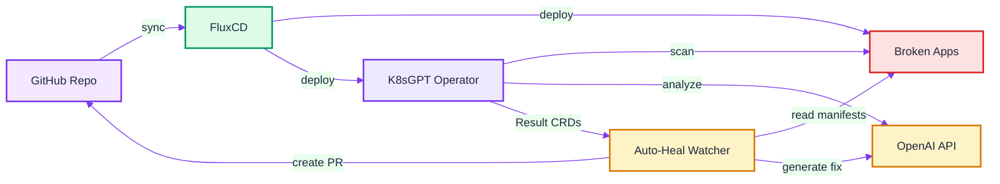
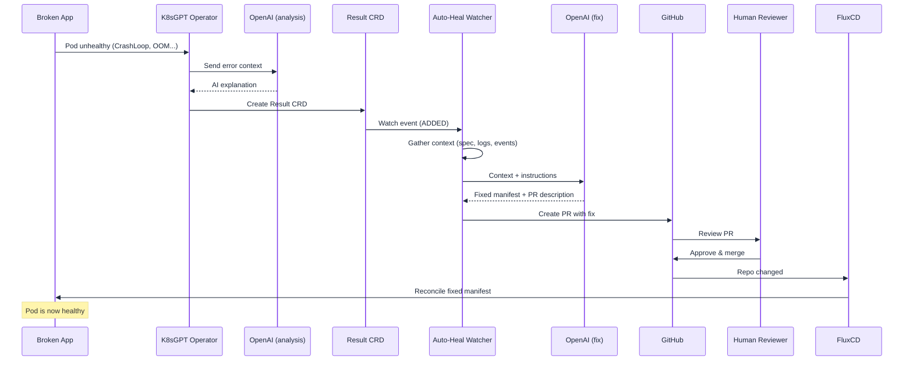

# K8sGPT Auto-Heal

### GitOps-Powered AI Self-Healing for Kubernetes

<span class="highlight-indigo">K8sGPT</span> +
<span class="highlight-green">FluxCD</span> +
<span class="highlight-orange">OpenAI</span> +
<span class="highlight-purple">GitHub</span>

<p class="small" style="margin-top: 20px; color: #64748b;">
A live demo of autonomous Kubernetes remediation<br>
with human-in-the-loop safety via Pull Requests
</p>

---

## Agenda

<div style="max-width: 650px; margin: 0 auto;">
<div class="agenda-item"><span class="step-number">1</span> The Problem — Why Auto-Healing?</div>
<div class="agenda-item"><span class="step-number">2</span> What is GitOps? — Principles &amp; Definition</div>
<div class="agenda-item"><span class="step-number">3</span> What is FluxCD? — GitOps in Practice</div>
<div class="agenda-item"><span class="step-number">4</span> What is K8sGPT? — AI-Powered Diagnostics</div>
<div class="agenda-item"><span class="step-number">5</span> Architecture &amp; Components</div>
<div class="agenda-item"><span class="step-number">6</span> The Remediation Loop</div>
<div class="agenda-item"><span class="step-number">7</span> Live Demo</div>
<div class="agenda-item"><span class="step-number">8</span> Security Considerations</div>
<div class="agenda-item"><span class="step-number">9</span> Takeaways &amp; Next Steps</div>
</div>

---

## <span class="step-number">1</span> The Problem

### Kubernetes fails silently — and often

--

## Common Failure Modes

| Symptom | Root Cause | Impact |
|---------|-----------|--------|
| <span class="highlight-red">CrashLoopBackOff</span> | Missing volumes, bad config | Service down, alert fatigue |
| <span class="highlight-red">OOMKilled</span> | Memory limits too low | Repeated restarts, instability |
| <span class="highlight-red">ImagePullBackOff</span> | Wrong tag, missing image | Deployment stuck |
| <span class="highlight-red">No Endpoints</span> | Selector mismatch | Traffic blackholed |

<p class="small muted">
These are <em>configuration errors</em>, not code bugs.
They follow patterns that an LLM can learn to fix.
</p>

--

## The Traditional Response

<div class="box">
<p><span class="highlight-red">Alert fires</span> &rarr; Engineer wakes up &rarr; <code>kubectl describe</code> &rarr; Google the error &rarr; Apply fix &rarr; Pray</p>
</div>

### What if the cluster could diagnose *and* propose fixes itself?

<p class="small muted">
...while still keeping a human in the loop for safety.
</p>

---

## <span class="step-number">2</span> What is GitOps?

### Principles &amp; Definition

--

## OpenGitOps Definition

<div class="box">
<p><strong>GitOps</strong> is a set of principles for operating and managing software systems. These principles are derived from modern software operations, but are also rooted in pre-existing and widely adopted best practices.</p>
<p class="small muted" style="margin-top:8px;">
&mdash; <a href="https://opengitops.dev">OpenGitOps</a>, a CNCF Sandbox project
</p>
</div>

<p class="small" style="margin-top:15px;">
The OpenGitOps project defines GitOps through <strong>four core principles</strong> that any GitOps-compliant system must follow.
</p>

--

## The Four OpenGitOps Principles

<div style="text-align:left; max-width:800px; margin:0 auto;">
<div class="box">
<p class="small"><strong class="highlight-indigo">1. Declarative</strong> — A system managed by GitOps must have its desired state expressed <em>declaratively</em>.</p>
</div>
<div class="box">
<p class="small"><strong class="highlight-purple">2. Versioned and Immutable</strong> — Desired state is stored in a way that enforces immutability, versioning, and retains a complete version history.</p>
</div>
<div class="box">
<p class="small"><strong class="highlight-green">3. Pulled Automatically</strong> — Software agents automatically pull the desired state declarations from the source.</p>
</div>
<div class="box">
<p class="small"><strong class="highlight-orange">4. Continuously Reconciled</strong> — Software agents <em>continuously</em> observe actual system state and attempt to apply the desired state.</p>
</div>
</div>

--

## GitOps in This Demo

| Principle | How It Applies |
|-----------|---------------|
| <span class="highlight-indigo">Declarative</span> | All Kubernetes resources are YAML manifests in Git |
| <span class="highlight-purple">Versioned &amp; Immutable</span> | Every change is a Git commit &mdash; auditable and reversible |
| <span class="highlight-green">Pulled Automatically</span> | FluxCD pulls from the repo on a schedule &mdash; no <code>kubectl apply</code> |
| <span class="highlight-orange">Continuously Reconciled</span> | Flux detects drift and re-applies the desired state |

<p class="small muted" style="margin-top:12px;">
The auto-heal watcher leverages these principles: fixes go through Git (versioned), Flux pulls them (automatic), and the cluster converges (reconciled).
</p>

---

## <span class="step-number">3</span> What is FluxCD?

### GitOps for Kubernetes

--

## FluxCD — How It Works

<div style="text-align:left; max-width:800px; margin:0 auto;">
<div class="box">
<h3 class="highlight-green">Source Controller</h3>
<p class="small">Watches Git repositories (or Helm repos, S3 buckets). Pulls changes on a schedule or webhook trigger.</p>
</div>
<div class="box">
<h3 class="highlight-green">Kustomize Controller</h3>
<p class="small">Applies Kustomization resources in dependency order. Handles variable substitution, health checks, and pruning.</p>
</div>
<div class="box">
<h3 class="highlight-green">Helm Controller</h3>
<p class="small">Manages HelmRelease resources. Installs, upgrades, and rolls back Helm charts declaratively.</p>
</div>
</div>

--

## Key Flux Concepts for This Demo

| Concept | What It Does | In This Demo |
|---------|-------------|-------------|
| `GitRepository` | Points Flux at a Git repo + branch | This repo (`main` branch) |
| `Kustomization` | Tells Flux which path to reconcile | 4 Kustomizations with dependency ordering |
| `HelmRelease` | Installs a Helm chart | K8sGPT operator from its Helm repo |
| `dependsOn` | Orders reconciliation | operator &rarr; config &rarr; watcher &rarr; apps |

<p class="small muted" style="margin-top:12px;">
When a PR is merged, Flux detects the change and reconciles &mdash; no CI pipeline needed for deployment.
</p>

---

## <span class="step-number">4</span> What is K8sGPT?

### AI-powered Kubernetes diagnostics

--

## K8sGPT Overview

<div class="box">
<p><strong>K8sGPT</strong> is an open-source tool that scans your Kubernetes cluster for issues and explains them in plain language using AI.</p>
</div>

<div class="columns">
<div class="box">
<h3 class="highlight-indigo">CLI Mode</h3>
<p class="small">Run <code>k8sgpt analyze</code> from your terminal for on-demand diagnostics. Great for debugging.</p>
</div>
<div class="box">
<h3 class="highlight-indigo">Operator Mode</h3>
<p class="small">Deploy the K8sGPT Operator in-cluster. It scans continuously and writes <code>Result</code> CRDs &mdash; the mode we use.</p>
</div>
</div>

--

## Pluggable AI Backends

<p class="small">K8sGPT is <strong>not tied to OpenAI</strong>. It supports multiple AI providers via a unified backend interface:</p>

| Backend | Provider | Use Case |
|---------|----------|----------|
| `openai` | OpenAI API (GPT-4o, GPT-4o-mini) | Best quality, cloud-hosted |
| `azureopenai` | Azure OpenAI Service | Enterprise compliance, data residency |
| `localai` | LocalAI (self-hosted) | Air-gapped, no data leaves the cluster |
| `ollama` | Ollama (local models) | Run Llama, Mistral, etc. on your GPU |
| `amazonbedrock` | AWS Bedrock | Claude, Titan on AWS |
| `googlevertexai` | Google Vertex AI | Gemini on GCP |

<p class="small muted" style="margin-top:10px;">
Configure via <code>k8sgpt auth add --backend openai --model gpt-4o-mini</code> (CLI)
or in the <code>K8sGPT</code> CR spec (Operator).
</p>

--

## Analyzers &amp; Filters

<p class="small">K8sGPT ships with <strong>20+ built-in analyzers</strong>. You select which ones to enable:</p>

<div class="columns">
<div>

| Analyzer | What It Checks |
|----------|---------------|
| `Pod` | CrashLoop, OOM, ImagePull, Pending |
| `Service` | No matching endpoints |
| `Deployment` | Unavailable replicas |
| `ReplicaSet` | Replica count mismatches |
| `Ingress` | Missing backend services |

</div>
<div>

| Analyzer | What It Checks |
|----------|---------------|
| `PVC` | Unbound persistent volumes |
| `CronJob` | Failed schedules |
| `NetworkPolicy` | Misconfigurations |
| `HPA` | Scaling issues |
| `Node` | NotReady, disk pressure |

</div>
</div>

<p class="small muted" style="margin-top:10px;">
In this demo: <code>spec.filters: [Pod, Service, Deployment, ReplicaSet]</code>
</p>

--

## Privacy &amp; Anonymization

<div class="columns">
<div class="box">
<h3 class="highlight-purple">Without anonymization</h3>
<p class="small">Pod names, namespaces, IPs, and environment details are sent to the AI backend as-is.</p>

```plaintext
Pod: prod-payments/checkout-7f8b9c-x2k
Error: OOMKilled (limit: 256Mi)
```

</div>
<div class="box">
<h3 class="highlight-green">With <code>anonymized: true</code></h3>
<p class="small">Sensitive identifiers are stripped before the AI call. Results are de-anonymized locally.</p>

```plaintext
Pod: namespace-a/workload-1-abc
Error: OOMKilled (limit: 256Mi)
```

</div>
</div>

<p class="small muted" style="margin-top:10px;">
Set <code>spec.anonymized: true</code> in the K8sGPT CR. For full data isolation, use a self-hosted backend (LocalAI/Ollama).
</p>

--

## The K8sGPT Operator

<div style="text-align:left; max-width:800px; margin:0 auto;">
<p><span class="step-number-sm">1</span> Deploy a <code>K8sGPT</code> Custom Resource specifying the AI backend and filters</p>
<p><span class="step-number-sm">2</span> The operator scans the cluster periodically (every ~2 minutes)</p>
<p><span class="step-number-sm">3</span> For each issue found, it creates a <code>Result</code> CRD:</p>
</div>

```yaml
apiVersion: core.k8sgpt.ai/v1alpha1
kind: Result
metadata:
  name: demo-apps-crashloopbackoff-nginx
spec:
  kind: Pod
  name: demo-apps/nginx-broken-xyz
  error:
    - "CrashLoopBackOff: back-off restarting failed container"
  details: "The pod is crash-looping because nginx cannot write
            to /var/cache/nginx due to readOnlyRootFilesystem..."
```

<p class="small muted">
These <code>Result</code> CRDs are the input to our auto-heal watcher.
</p>

--

## K8sGPT CLI — Live Demo

<p class="small">Deploy 3 intentionally broken apps (direct <code>kubectl</code>, not Flux-managed):</p>

<div class="cmd-box">$ ./setup.sh cli-demo</div>

<p class="small" style="margin-top:8px;">Check that pods are failing:</p>

<div class="cmd-box">$ kubectl get pods -n k8sgpt-cli-demo</div>

```plaintext
NAME                             READY   STATUS             RESTARTS   AGE
nginx-broken-xyz                 0/1     CrashLoopBackOff   3          2m
memory-hog-abc                   0/1     OOMKilled          2          2m
bad-image-app-def                0/1     ImagePullBackOff   0          2m
```

--

## K8sGPT CLI — Analyze

<p class="small">Run K8sGPT to scan for issues (no AI, just detection):</p>

<div class="cmd-box">$ k8sgpt analyze --namespace k8sgpt-cli-demo</div>

<p class="small" style="margin-top:10px;">Add <code>--explain</code> to get an AI-powered explanation:</p>

<div class="cmd-box">$ k8sgpt analyze --namespace k8sgpt-cli-demo --explain</div>

<p class="small" style="margin-top:10px;">Filter by specific analyzer:</p>

<div class="cmd-box">$ k8sgpt analyze --namespace k8sgpt-cli-demo --filter Pod --explain</div>

<p class="small" style="margin-top:10px;">Output as JSON for scripting:</p>

<div class="cmd-box">$ k8sgpt analyze --namespace k8sgpt-cli-demo --explain --output json</div>

--

## K8sGPT CLI — Example Output

```plaintext
$ k8sgpt analyze --namespace k8sgpt-cli-demo --explain

 0 k8sgpt-cli-demo/nginx-broken-xyz(nginx)
-- CrashLoopBackOff: back-off 1m20s restarting failed container
-- Error: the container is crash-looping because nginx cannot write
   to /var/cache/nginx and /var/run due to readOnlyRootFilesystem.
   Solution: add emptyDir volumes for these paths.

 1 k8sgpt-cli-demo/memory-hog-abc(stress)
-- OOMKilled
-- Error: the container is being killed because it tries to allocate
   200MB but the memory limit is set to 100Mi.
   Solution: increase the memory limit to at least 256Mi.

 2 k8sgpt-cli-demo/bad-image-app-def(app)
-- ImagePullBackOff: image "nginx:99.99.99-nonexistent" not found
-- Error: the specified image tag does not exist.
   Solution: use a valid tag such as nginx:1.25 or nginx:latest.
```

<p class="small muted">
This is exactly what the <strong>Operator</strong> does automatically — but as <code>Result</code> CRDs instead of terminal output.
</p>

--

## CLI Demo — Cleanup

<div class="cmd-box">$ ./setup.sh cli-demo-cleanup</div>

<p class="small muted" style="margin-top:12px;">
Deletes the <code>k8sgpt-cli-demo</code> namespace. No impact on the Flux-managed environment.
</p>

---

## <span class="step-number">5</span> Architecture

### Four components, one feedback loop

--

## Component Overview

<div class="columns">
<div class="box">
<h3 class="highlight-green">FluxCD</h3>
<p class="small">GitOps operator. Watches the repo, reconciles desired state into the cluster. Single source of truth.</p>
</div>
<div class="box">
<h3 class="highlight-indigo">K8sGPT Operator</h3>
<p class="small">Scans the cluster every 2 min. Detects issues, calls OpenAI for analysis, creates <code>Result</code> CRDs.</p>
</div>
</div>
<div class="columns" style="margin-top: 8px;">
<div class="box">
<h3 class="highlight-orange">Auto-Heal Watcher</h3>
<p class="small">Python controller. Watches <code>Result</code> CRDs, gathers K8s context, calls OpenAI for fixes, creates PRs.</p>
</div>
<div class="box">
<h3 class="highlight-purple">GitHub</h3>
<p class="small">Receives auto-generated PRs with full diagnosis + fix. Human reviews, merges. Flux reconciles.</p>
</div>
</div>

--

## Wait — Can't K8sGPT Fix Things Itself?

<div class="box">
<p><strong>Yes.</strong> K8sGPT offers two built-in auto-remediation paths:</p>
<ul class="small" style="margin-top:8px;">
<li><strong>CLI:</strong> <code>k8sgpt analyze --explain --auto-fix</code> — applies patches directly via <code>kubectl</code></li>
<li><strong>Operator:</strong> Set <code>spec.ai.autoRemediate: true</code> in the K8sGPT CR — the operator patches resources in-cluster automatically</li>
</ul>
<p class="small" style="margin-top:8px;">So why build a watcher + GitOps pipeline on top?</p>
</div>

--

## Three Approaches Compared

| | `--auto-fix` (CLI) | Operator `autoRemediate` | Watcher + GitOps |
|---|---|---|---|
| **Speed** | <span class="highlight-green">Instant</span> | <span class="highlight-green">Instant</span> | Minutes (PR + merge) |
| **Automation** | <span class="highlight-red">Manual trigger</span> | <span class="highlight-green">Fully automatic</span> | <span class="highlight-green">Fully automatic</span> |
| **Audit trail** | <span class="highlight-red">None</span> | <span class="highlight-red">K8s events only</span> | <span class="highlight-green">Full Git history + PR</span> |
| **Rollback** | <span class="highlight-red">Manual</span> | <span class="highlight-red">Manual</span> | <span class="highlight-green">git revert</span> |
| **Human review** | <span class="highlight-orange">Optional</span> | <span class="highlight-red">None</span> | <span class="highlight-green">Required (PR gate)</span> |
| **GitOps drift** | <span class="highlight-red">Cluster diverges</span> | <span class="highlight-red">Cluster diverges</span> | <span class="highlight-green">Git = truth</span> |
| **Blast radius** | <span class="highlight-red">Cluster write</span> | <span class="highlight-red">Cluster write</span> | <span class="highlight-green">Watcher is read-only</span> |

--

## Why GitOps Matters Here

<div style="text-align:left; max-width:800px; margin:0 auto;">
<div class="box">
<p class="small"><strong class="highlight-green">No cluster drift</strong> — A direct <code>kubectl apply</code> fix exists only in the cluster. Next Flux reconciliation reverts it. With GitOps, the fix lives in Git and Flux enforces it permanently.</p>
</div>
<div class="box">
<p class="small"><strong class="highlight-indigo">Trust but verify</strong> — LLMs hallucinate. A CrashLoopBackOff fix might introduce a security hole. The PR lets a human catch bad suggestions before they hit production.</p>
</div>
<div class="box">
<p class="small"><strong class="highlight-orange">Compliance &amp; governance</strong> — Regulated environments require change approval records. Every fix is a signed, reviewable commit — not an anonymous API call.</p>
</div>
<div class="box">
<p class="small"><strong class="highlight-purple">Composability</strong> — The watcher is a thin glue layer. Swap the LLM, add Slack notifications, require 2 approvals — the architecture stays the same.</p>
</div>
</div>

--

## Architecture Diagram



<p class="small" style="margin-top:12px;">
<span class="highlight-green">Flux reconciliation order:</span>
k8sgpt-operator &rarr; k8sgpt-config &rarr; auto-heal-watcher &rarr; apps
</p>

--

## The Remediation Flow



--

## Project Structure

```plaintext
k8sgpt-auto-heal-demo/
├── setup.sh                      # Main entry point
├── scripts/
│   ├── 01-create-cluster.sh      # Kind cluster (1 CP + 2 workers)
│   ├── 02-bootstrap-flux.sh      # Render templates + Flux bootstrap
│   ├── 03-create-secrets.sh      # API keys (kubectl — not in Git)
│   ├── 04-deploy-watcher.sh      # Build & load watcher image
│   ├── 05-deploy-broken-apps.sh  # Commit broken manifests (GitOps)
│   └── 06-teardown.sh            # Destroy everything
├── clusters/k8sgpt-demo/         # Flux Kustomizations
├── infrastructure/               # K8sGPT operator, config, watcher
├── apps/k8sgpt-demo/             # Demo apps (deployed by Flux)
├── manifests/broken-apps/        # Intentionally broken manifests
└── watcher/                      # Python auto-heal controller
```

---

## <span class="step-number">6</span> The Remediation Loop

### From broken pod to merged PR — automatically

--

## Step-by-Step Flow

<div style="text-align:left; max-width:800px; margin:0 auto;">
<p><span class="step-number-sm">1</span> <span class="highlight-red">Broken app</span> is deployed via Flux from the repo</p>
<p><span class="step-number-sm">2</span> <span class="highlight-indigo">K8sGPT</span> scans the cluster, detects the issue</p>
<p><span class="step-number-sm">3</span> K8sGPT creates a <code>Result</code> CRD with error + AI analysis</p>
<p><span class="step-number-sm">4</span> <span class="highlight-orange">Watcher</span> detects the new Result</p>
<p><span class="step-number-sm">5</span> Watcher gathers context: pod spec, logs, events, deployment YAML</p>
<p><span class="step-number-sm">6</span> Watcher calls <span class="highlight-orange">OpenAI</span> with full context</p>
<p><span class="step-number-sm">7</span> OpenAI returns a <em>fixed manifest</em> + <em>PR description</em></p>
<p><span class="step-number-sm">8</span> Watcher creates a <span class="highlight-purple">GitHub PR</span></p>
<p><span class="step-number-sm">9</span> <strong>Human reviews and merges</strong> (safety gate)</p>
<p><span class="step-number-sm">10</span> <span class="highlight-green">Flux reconciles</span> &rarr; broken app is healed</p>
</div>

--

## The Watcher — Core Logic

```python
# Simplified watch loop
while True:
    for event in watch(Result CRDs):
        if event is NEW or MODIFIED:
            # 1. Skip if already processed (check annotation)
            # 2. Gather context (pod spec, logs, events, deployment)
            # 3. Call OpenAI with context -> get fix + PR description
            # 4. Create GitHub PR with the fix
            # 5. Annotate Result CRD as "pr-created"
```

<div class="small" style="margin-top:12px;">
<p><strong>State tracking annotations:</strong></p>
<p><code>k8sgpt-auto-heal/remediation-state</code>: <code>in-progress</code> | <code>pr-created</code> | <code>failed</code> | <code>dry-run</code></p>
<p><code>k8sgpt-auto-heal/pr-url</code>: link to the created PR</p>
</div>

--

## Demo Scenarios

| Scenario | What's Broken | K8sGPT Detects | OpenAI Fixes |
|----------|--------------|----------------|-------------|
| `nginx` | readOnlyRootFilesystem | CrashLoopBackOff | Adds emptyDir volumes |
| `oom` | Memory limit too low | OOMKilled | Increases memory limit |
| `service` | Selector matches nothing | No endpoints | Fixes selector labels |
| `image` | Non-existent image tag | ImagePullBackOff | Corrects image tag |

---

## <span class="step-number">7</span> Live Demo

### Let's break things and watch the cluster heal itself

--

## Demo Step 1 — Prerequisites

<p class="small">Verify all tools are installed:</p>

<div class="cmd-box">$ docker --version</div>
<div class="cmd-box">$ kind --version</div>
<div class="cmd-box">$ kubectl version --client</div>
<div class="cmd-box">$ helm version --short</div>
<div class="cmd-box">$ flux --version</div>

<p class="small muted" style="margin-top:12px;">
You also need a <code>.env</code> file with <code>GITHUB_TOKEN</code>,
<code>GITHUB_USER</code>, <code>GITHUB_REPO</code>, and <code>OPENAI_API_KEY</code>.
</p>

--

## Demo Step 2 — Full GitOps Setup

<p class="small">One command creates the entire environment:</p>

<div class="cmd-box">$ ./setup.sh full</div>

<p class="small" style="margin-top:12px;">This runs 4 scripts in sequence:</p>

<div style="text-align:left; max-width:700px; margin:0 auto;" class="small">
<p><span class="step-number-sm">1</span> <strong>Create Kind cluster</strong> — 1 control-plane + 2 workers</p>
<p><span class="step-number-sm">2</span> <strong>Bootstrap FluxCD</strong> — Commits manifests, connects cluster to GitHub</p>
<p><span class="step-number-sm">3</span> <strong>Create secrets</strong> — API keys via kubectl (not in Git)</p>
<p><span class="step-number-sm">4</span> <strong>Deploy watcher</strong> — Build image, load into Kind, Flux deploys</p>
</div>

--

## Demo Step 3 — Verify Infrastructure

<p class="small">Check that everything is running:</p>

<div class="cmd-box">$ kubectl get nodes</div>
<div class="cmd-box">$ flux get kustomizations</div>
<div class="cmd-box">$ kubectl -n k8sgpt-operator-system get pods</div>
<div class="cmd-box">$ kubectl -n k8sgpt-auto-heal get pods</div>

<p class="small muted" style="margin-top:12px;">
All Flux kustomizations should show <span class="highlight-green">Ready</span>.
K8sGPT operator and watcher pods should be <span class="highlight-green">Running</span>.
</p>

--

## Demo Step 4 — Deploy Broken Apps

<p class="small">Commit intentionally broken manifests via GitOps:</p>

<div class="cmd-box">$ ./setup.sh break all</div>

<p class="small" style="margin-top:8px;">Or deploy individually:</p>

<div class="cmd-box">$ ./setup.sh break nginx    <span style="color:#94a3b8;"># CrashLoopBackOff</span></div>
<div class="cmd-box">$ ./setup.sh break oom      <span style="color:#94a3b8;"># OOMKilled</span></div>
<div class="cmd-box">$ ./setup.sh break service  <span style="color:#94a3b8;"># No endpoints</span></div>
<div class="cmd-box">$ ./setup.sh break image    <span style="color:#94a3b8;"># ImagePullBackOff</span></div>

<p class="small muted" style="margin-top:10px;">
This commits manifests to Git. Flux picks them up and deploys — <strong>pure GitOps</strong>.
</p>

--

## Demo Step 5 — Watch the Pipeline

<p class="small">Open multiple terminals to observe the flow:</p>

<div class="cmd-box"><span style="color:#94a3b8;"># Terminal 1: Pod status (see failures appear)</span><br>
$ kubectl get pods -n demo-apps -w</div>

<div class="cmd-box"><span style="color:#94a3b8;"># Terminal 2: K8sGPT Results (AI analysis)</span><br>
$ kubectl get results -n k8sgpt-operator-system -w</div>

<div class="cmd-box"><span style="color:#94a3b8;"># Terminal 3: Watcher logs (remediation in action)</span><br>
$ kubectl -n k8sgpt-auto-heal logs -f deploy/auto-heal-watcher</div>

<div class="cmd-box"><span style="color:#94a3b8;"># Terminal 4: Flux status</span><br>
$ flux get kustomizations</div>

--

## Demo Step 6 — Review the Auto-Generated PR

<p class="small">Check GitHub for the automatically created Pull Request:</p>

<div class="cmd-box">$ gh pr list --repo ${GITHUB_USER}/${GITHUB_REPO}</div>

<p class="small" style="margin-top:15px;">The PR contains:</p>

<div style="text-align:left; max-width:600px; margin:0 auto;" class="small">
<p>&#x2022; <strong>Root cause analysis</strong> — what went wrong and why</p>
<p>&#x2022; <strong>K8s context</strong> — pod events, logs, current spec</p>
<p>&#x2022; <strong>Fixed manifest</strong> — ready-to-merge YAML</p>
<p>&#x2022; <strong>Explanation</strong> — what was changed and why</p>
</div>

--

## Demo Step 7 — Merge and Heal

<p class="small">Approve and merge the PR (human-in-the-loop):</p>

<div class="cmd-box">$ gh pr merge --merge --repo ${GITHUB_USER}/${GITHUB_REPO} &lt;PR_NUMBER&gt;</div>

<p class="small" style="margin-top:12px;">Then trigger immediate reconciliation:</p>

<div class="cmd-box">$ flux reconcile source git flux-system --timeout=1m</div>
<div class="cmd-box">$ flux reconcile kustomization apps --timeout=1m</div>

<p class="small" style="margin-top:12px;">Watch the pod heal:</p>

<div class="cmd-box">$ kubectl get pods -n demo-apps -w</div>

<p class="small" style="margin-top:10px; color:#059669;">
The broken pod transitions from CrashLoopBackOff/OOMKilled &rarr; Running
</p>

--

## Demo Step 8 — Teardown

<div class="cmd-box">$ ./setup.sh teardown</div>

<p class="small muted" style="margin-top:12px;">
Deletes the Kind cluster. GitHub repo is preserved.
</p>

---

## <span class="step-number">8</span> Security Considerations

### Safety by design

--

## Security Model

<div class="columns">
<div class="box">
<h3 class="highlight-green">What the watcher CAN do</h3>
<ul class="small">
<li><strong>Read</strong> pods, deployments, events, logs</li>
<li><strong>Annotate</strong> K8sGPT Result CRDs</li>
<li><strong>Create PRs</strong> on GitHub</li>
</ul>
</div>
<div class="box">
<h3 class="highlight-red">What the watcher CANNOT do</h3>
<ul class="small">
<li>kubectl apply anything</li>
<li>Modify or delete resources</li>
<li>Bypass the PR review process</li>
<li>Access secrets beyond its own</li>
</ul>
</div>
</div>

<p class="small" style="margin-top:12px;">
<strong>Key principle:</strong> All changes flow through
<span class="highlight-purple">Git</span> &rarr;
<span class="highlight-purple">PR review</span> &rarr;
<span class="highlight-green">Flux reconciliation</span>.
<br>The watcher never directly mutates cluster state.
</p>

--

## K8sGPT Operator Permissions

<div class="columns">
<div class="box">
<h3 class="highlight-green">What the operator CAN do</h3>
<ul class="small">
<li><strong>Read</strong> all cluster resources (pods, deployments, services, events, nodes, etc.)</li>
<li><strong>Create/Update/Delete</strong> its own <code>Result</code> CRDs</li>
<li><strong>Call external AI APIs</strong> (OpenAI, Azure, etc.) for analysis</li>
<li><strong>Patch resources</strong> when <code>autoRemediate: true</code> is enabled</li>
</ul>
</div>
<div class="box">
<h3 class="highlight-red">What the operator CANNOT do</h3>
<ul class="small">
<li>Access secrets outside its namespace (unless explicitly granted)</li>
<li>Modify RBAC, namespaces, or CRDs</li>
<li>Interact with Git or CI/CD pipelines</li>
<li>Override Flux-managed resources persistently (Flux reverts drift)</li>
</ul>
</div>
</div>

<p class="small muted" style="margin-top:12px;">
In this demo, <code>autoRemediate</code> is <strong>disabled</strong>.
The operator only produces <code>Result</code> CRDs — the watcher handles remediation via GitOps.
</p>

--

## Production Hardening

<div style="text-align:left; max-width:750px; margin:0 auto;">
<div class="box">
<p class="small"><strong class="highlight-purple">Data privacy</strong> — Use K8sGPT's <code>anonymized: true</code> to strip pod names and namespaces before sending to OpenAI.</p>
</div>
<div class="box">
<p class="small"><strong class="highlight-purple">Self-hosted LLM</strong> — Replace OpenAI with LocalAI or Ollama to keep all data in-cluster.</p>
</div>
<div class="box">
<p class="small"><strong class="highlight-purple">Branch protection</strong> — Require PR approvals, status checks, and signed commits.</p>
</div>
<div class="box">
<p class="small"><strong class="highlight-purple">RBAC scoping</strong> — Watcher has read-only ClusterRole. Annotate-only write on Result CRDs.</p>
</div>
</div>

---

## <span class="step-number">9</span> Takeaways

--

## Key Takeaways

<div style="text-align:left; max-width:800px; margin:0 auto;">
<div class="box">
<p class="small"><strong class="highlight-green">GitOps is the foundation</strong> — Flux ensures every change is versioned, auditable, and reversible. The watcher never bypasses Git.</p>
</div>
<div class="box">
<p class="small"><strong class="highlight-indigo">AI augments, humans decide</strong> — The LLM proposes fixes; a human must approve the PR. This is <em>assisted</em> remediation, not autonomous.</p>
</div>
<div class="box">
<p class="small"><strong class="highlight-orange">Configuration errors are predictable</strong> — CrashLoopBackOff, OOMKilled, ImagePullBackOff follow patterns that LLMs handle well.</p>
</div>
<div class="box">
<p class="small"><strong class="highlight-purple">The loop is composable</strong> — Swap OpenAI for a local LLM, replace GitHub with GitLab, add Slack notifications — each component is independent.</p>
</div>
</div>

--

## What Could Come Next

<div style="text-align:left; max-width:700px; margin:0 auto;" class="small">
<p>&#x2022; <strong>Multi-cluster support</strong> — centralized watcher for fleet management</p>
<p>&#x2022; <strong>Confidence scoring</strong> — auto-merge low-risk fixes, require review for high-risk</p>
<p>&#x2022; <strong>Learning from merges</strong> — fine-tune the model on accepted vs. rejected PRs</p>
<p>&#x2022; <strong>Slack/Teams notifications</strong> — alert on new PRs with one-click approve</p>
<p>&#x2022; <strong>Drift detection</strong> — compare running state vs. Git and remediate divergence</p>
</div>

--

## Thank You

<a href="https://github.com/syalioune/k8sgpt-auto-heal-demo">github.com/syalioune/k8sgpt-auto-heal-demo</a>

<div class="box" style="text-align:center;">
<p class="small">
<span class="highlight-indigo">K8sGPT</span> &mdash;
<a href="https://k8sgpt.ai">k8sgpt.ai</a>
&nbsp;|&nbsp;
<span class="highlight-green">FluxCD</span> &mdash;
<a href="https://fluxcd.io">fluxcd.io</a>
&nbsp;|&nbsp;
<span class="highlight-orange">OpenAI</span> &mdash;
<a href="https://platform.openai.com">platform.openai.com</a>
</p>
</div>

<p class="small muted">Questions?</p>
